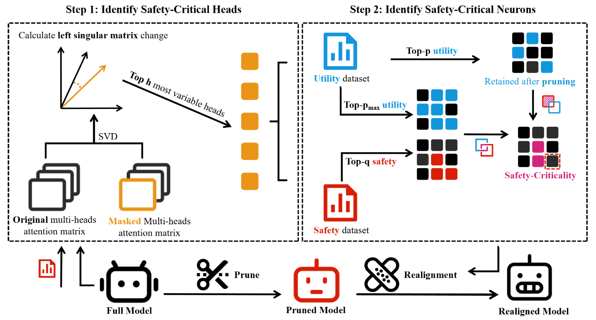

# [ACL 2025] Hierarchical Safety Realignment: Lightweight Restoration of Safety in Pruned Large Vision-Language Models

Yue Li*, Xin Yi*, Dongsheng Shi, Gerard de Melo, Xiaoling Wang, Linlin Wang†.



Because the code needs time to sort out, the code file has not been uploaded for the time being.

## 🔔 News

- \[2025.05.16\]. Our work is accepted by ACL 2025 (Findings)!

## Quick Start

We use [llava-next-llama3-8b-hf](https://modelscope.cn/models/llava-hf/llama3-llava-next-8b-hf) as an example to show the workflow of hsr.

### Environment Preparation

```python
conda create --name hsr python=3.9
conda activate hsr
pip install -r requirements.txt
```

### Dataset Preparation

We utilize the [VLGuard](https://huggingface.co/datasets/ys-zong/VLGuard) to identify safety-critical attention heads and neurons. The training subset is downloaded into the "data_process" folder.

Next, we execute the get_data.py script, which generates two files: train_safe_safes.json and train_unsafes.json. These files serve as the utility and safety datasets, respectively.

### HSR

#### Step 1

In the SafetyHeadAttribution-hsr folder, modify the model path, data path, and other relevant settings in llava_next_ships_llama.py, then execute the script. By default, the files containing the Ships scores for each head will be saved in the SafetyHeadAttribution-hsr/exp_res/llama3-llava directory (we have included the results from our run).

### Step 2

In the alignment-attribution-hsr folder, modify the llama3_llava.sh script. In addition, you need to modify the settings (e.g., model path) in main.py and lib/data.py.

- get pruned model
```
model="llama3-llava-next-8b-hf"
method="lvlm_wanda_hf"
type="unstructured"
device="cuda:7"
suffix="weightonly"
data_mode="train_safes"
heads_paths="/home/liyue/psafety/SafetyHeadAttribution-hsr/exp_res/llama3-llava/train_unsafes.json_0.jsonl"
save_dir="out/$model/$type/${method}_${suffix}/"

python main.py \
    --model $model \
    --prune_method $method \
    --prune_data VLguard\
    --sparsity_ratio 0.5 \
    --sparsity_type $type \
    --save $save_dir \
    --device $device \
    --data_mode $data_mode
```
- get important score
```
# you shold get safety and utility important scores
model="llama3-llava-next-8b-hf"
method="lvlm_wanda_hf"
type="unstructured"
device="cuda:7"
suffix="weightonly"
data_mode="train_safes" # train_unsafes
heads_paths="/home/liyue/psafety/SafetyHeadAttribution-hsr/exp_res/llama3-llava/train_unsafes.json_0.jsonl"
save_dir="out/$model/$type/${method}_${suffix}/"

python main.py \
    --model $model \
    --prune_method $method \
    --prune_data VLguard\
    --sparsity_ratio 0.5 \
    --sparsity_type $type \
    --save $save_dir \
    --device $device \
    --data_mode $data_mode --dump_wanda_score
```
- get realigned model
```
model="llama3-llava-next-8b-hf"
method="lvlm_wanda_recover_heads_gqa"
type="unstructured"
device="cuda:7"
suffix="weightonly"
data_mode="train_safes"
heads_paths="/home/liyue/psafety/SafetyHeadAttribution-hsr/exp_res/llama3-llava/train_unsafes.json_0.jsonl"
save_dir="out/$model/$type/${method}_${suffix}/"

python main.py \
    --model $model \
    --prune_method $method \
    --prune_data VLguard\
    --sparsity_ratio 0.5 \
    --sparsity_type $type \
    --save $save_dir \
    --device $device \
    --data_mode $data_mode --p 0.5 --q 0.5 --max_p 0.7 --top_h 4 --heads_paths $heads_paths
```

## Citation
If you find our work useful, please consider citing our paper:
```

```

Our codebase is built upon on the following works:
```
@article{zhou2024role,
  title={On the Role of Attention Heads in Large Language Model Safety},
  author={Zhou, Zhenhong and Yu, Haiyang and Zhang, Xinghua and Xu, Rongwu and Huang, Fei and Wang, Kun and Liu, Yang and Fang, Junfeng and Li, Yongbin},
  journal={arXiv preprint arXiv:2410.13708},
  year={2024}
}
```
```
@inproceedings{wei2024assessing,
  title={Assessing the brittleness of safety alignment via pruning and low-rank modifications},
  author={Wei, Boyi and Huang, Kaixuan and Huang, Yangsibo and Xie, Tinghao and Qi, Xiangyu and Xia, Mengzhou and Mittal, Prateek and Wang, Mengdi and Henderson, Peter},
  booktitle={Proceedings of the 41st International Conference on Machine Learning},
  pages={52588--52610},
  year={2024}
}
```
